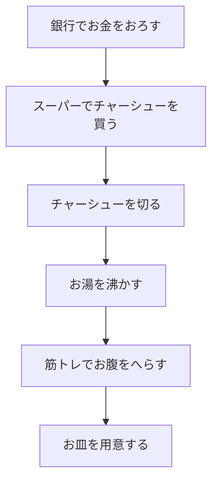

```mermaid
flowchart TD
    k3_1["銀行でお金をおろす"]
    k3_2["スーパーでチャーシューを買う"]
    k3_3["チャーシューを切る"]
    k3_4["お皿を用意する"]
    k3_5["お湯を沸かす"]
    k3_6["筋トレでお腹をへらす"]
    k3_1-->k3_2-->k3_3-->k3_5-->k3_6-->k3_4
```