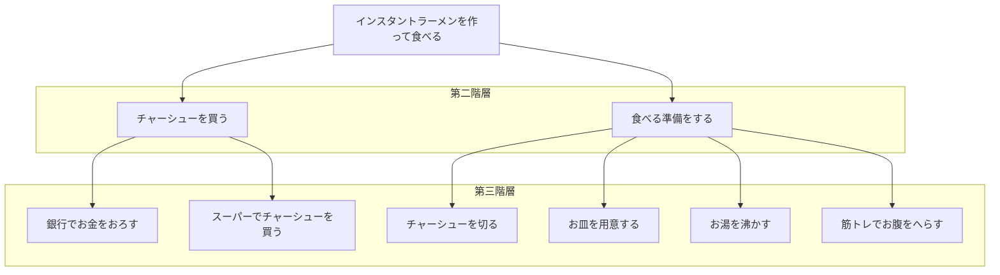

```mermaid
flowchart TD
    k1_1["インスタントラーメンを作って食べる"]
    subgraph 第二階層
    k2_1["チャーシューを買う"]
    k2_2["食べる準備をする"]
    end
    k1_1-->k2_1 & k2_2
    subgraph 第三階層
    k3_1["銀行でお金をおろす"]
    k3_2["スーパーでチャーシューを買う"]
    k3_3["チャーシューを切る"]
    k3_4["お皿を用意する"]
    k3_5["お湯を沸かす"]
    k3_6["筋トレでお腹をへらす"]
    end
    k2_1-->k3_1 & k3_2
    k2_2-->k3_3 & k3_4 & k3_5 & k3_6
```