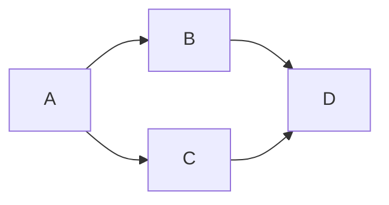
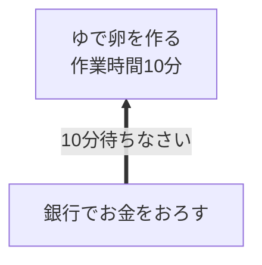
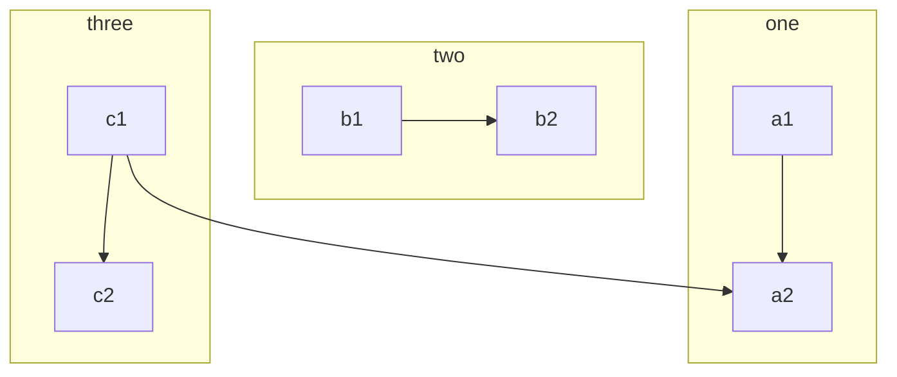
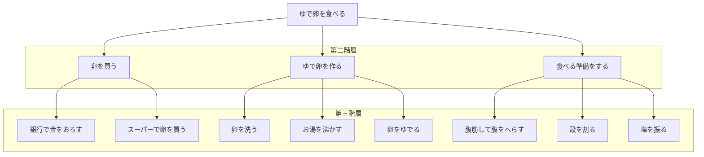

```mermaid
graph LR;
    A-->B;
    A-->C;
    B-->D;
    C-->D;
```

```mermaid
flowchart BT
    id1["銀行でお金をおろす"]
    id2["ゆで卵を作る
    作業時間10分"]
    id1==10分待ちなさい==>id2
```

```mermaid
flowchart TB
    c1-->a2
    subgraph one
    a1-->a2
    end
    subgraph two
    b1-->b2
    end
    subgraph three
    c1-->c2
    end
```

```mermaid
flowchart TD
    k1_1["ゆで卵を食べる"]
    subgraph 第二階層
    k2_1["卵を買う"]
    k2_2["ゆで卵を作る"]
    k2_3["食べる準備をする"]
    end
    k1_1-->k2_1 & k2_2 & k2_3
    subgraph 第三階層
    k3_1["銀行で金をおろす"]
    k3_2["スーパーで卵を買う"]
    k3_3["卵を洗う"]
    k3_4["お湯を沸かす"]
    k3_5["卵をゆでる"]
    k3_6["腹筋して腹をへらす"]
    k3_7["殻を割る"]
    k3_8["塩を振る"]
    end
    k2_1-->k3_1 & k3_2
    k2_2-->k3_3 & k3_4 & k3_5
    k2_3-->k3_6 & k3_7 & k3_8
```